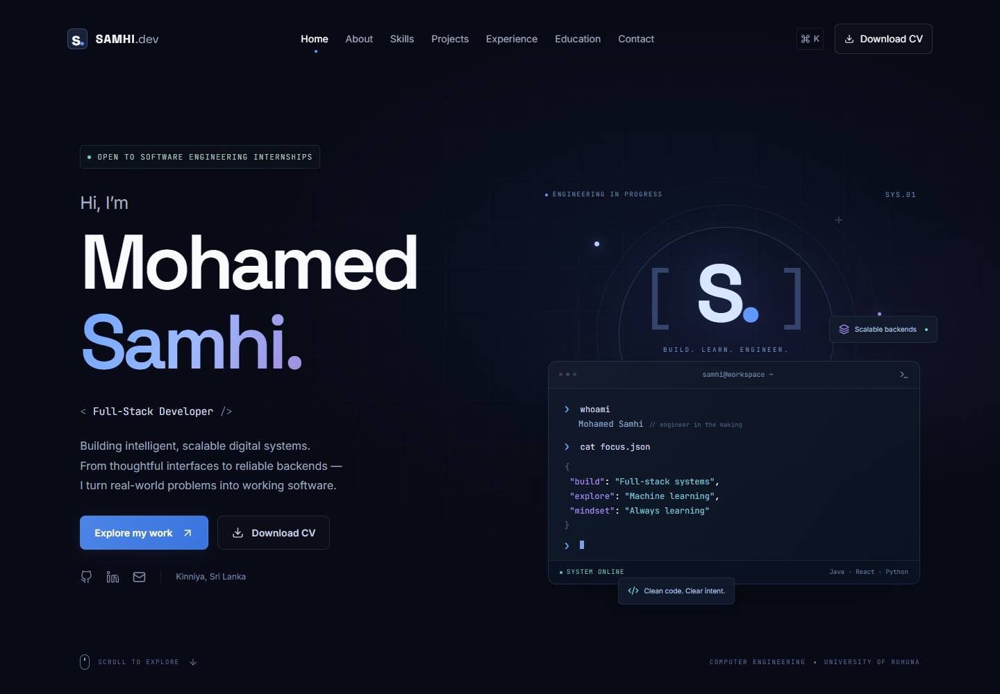

# Mohamed Samhi — Engineering Portfolio

A cinematic, accessible portfolio for Abdul Gaffoor Mohamed Samhi: a Computer Engineering undergraduate at the University of Ruhuna. The frontend is a real Next.js application; the API is Java/Spring Boot backed by PostgreSQL. Contact messages are persisted, never simulated.

## Preview

The local Docker frontend is at **http://127.0.0.1:3001** in the configured development environment. The supplied `.env.example` uses port 3000 by default. Use the explicit `127.0.0.1` address on this machine: an existing app also listens on the IPv6 localhost address. A separate development preview can use **http://127.0.0.1:3100**.

Screenshots generated by `node scripts/visual-check.mjs` are in `output/preview/`. The downloadable CV is a one-page résumé generated solely from the supplied facts. Replace it with an approved personal résumé whenever needed.



## Features

- Dark editorial design, self-hosted Space Grotesk, Inter and JetBrains Mono typography.
- Lightweight orbital engineering visual, animated terminal, short session-only loader, scroll progress, section reveals and desktop cursor.
- Four project case studies with architecture, features, challenges and contribution context. Interface previews are explicitly illustrative.
- Technology filters, mobile navigation, Ctrl/Cmd+K navigation and keyboard-accessible Radix dialogs.
- Academic journey, education, IESL membership, competition participation and GitHub repository links. No invented dates, rankings or metrics.
- React Hook Form + Zod validation; Spring validation, JPA persistence, Flyway migrations and global API errors.
- Reduced motion, visible focus, semantic HTML, error recovery, metadata, structured data, sitemap and robots.
- Multi-stage Docker images with non-root runtime users and health checks.

## Stack

Frontend: Next.js 16, React 19, strict TypeScript, Tailwind CSS 4, Framer Motion, GSAP, Lucide, Radix Dialog, React Hook Form, Zod.

Backend: Java 21, Spring Boot 4.1.1, Spring Web MVC, Spring Data JPA/Hibernate, Validation, Lombok, Maven, Flyway, PostgreSQL 18.

The npm lockfile pins the resolved dependencies. Tests use H2 in PostgreSQL mode; the running system uses PostgreSQL.

## Architecture

```text
Browser → Next.js frontend → Spring Boot REST API → PostgreSQL
                                 │
                          Controller + validated DTO
                                 │
                         Service interface / implementation
                                 │
                         Mapper + JPA repositories
```

```text
frontend/
  app/                     App Router, metadata and global styling
  components/sections/     Hero, content, projects and contact
  components/ui/           Shared reveals and icons
  constants/               Authentic, curated content and local fallback
  services/                Central API client
  lib/                     Shared frontend validation
  types/                   Strict API/content contracts
  public/resume/           Downloadable CV
  tests/                   Playwright interaction and responsive tests
backend/src/main/
  java/com/samhi/portfolio/
    controller/            HTTP boundaries
    service/impl/          Application logic
    repository/            JPA persistence
    entity/                Normalized data model
    dto/                   Request and response contracts
    mapper/                Entity-to-DTO mapping
    config/                CORS and initial content seed
    exception/             Consistent API errors
    security/              Bounded body / contact request limits
  resources/
    db/migration/          Versioned PostgreSQL schema
    content/               Initial catalog seed
scripts/                   Seed sync, résumé creation and visual checks
docker-compose.yml         Frontend + backend + PostgreSQL
```

## Start everything with Docker

Requirements: Docker Desktop with the Linux engine available.

1. Copy `.env.example` to `.env`.
2. Set a long, random `DB_PASSWORD`. Do not commit `.env`.
3. Run:

```sh
docker compose up --build -d
docker compose ps
```

Open the configured `FRONTEND_PORT` (default 3000). Browser requests use `NEXT_PUBLIC_API_URL`, so this must be a browser-reachable address, not the Docker service name. PostgreSQL has no exposed host port. Named volume `portfolio_data` retains messages across restarts.

Stop with `docker compose down`. Removing its volume deletes stored messages, so do not use `down -v` unless deliberately resetting the database.

## Local frontend

```sh
cd frontend
npm ci
# Copy .env.example to .env.local and adjust URLs if needed.
npm run dev
```

For a separate preview port: `npm run dev -- --port 3100` and open `http://127.0.0.1:3100`. Add that origin to the backend `FRONTEND_URL`.

```sh
npm run build
npm run typecheck
```

## Local backend

Requirements: JDK 21, Maven 3.9+, PostgreSQL 18 (or a supported PostgreSQL instance).

Create the database and set `DB_URL`, `DB_USERNAME`, `DB_PASSWORD`, `FRONTEND_URL`. Spring reads environment variables, not `.env` files automatically. The local `.tools/apache-maven-3.9.11/bin/mvn.cmd` is available if installed during setup.

```sh
cd backend
mvn spring-boot:run
```

PowerShell example (use your own password):

```powershell
$env:DB_URL='jdbc:postgresql://localhost:5432/portfolio'
$env:DB_USERNAME='portfolio'
$env:DB_PASSWORD='<your-local-password>'
$env:FRONTEND_URL='http://127.0.0.1:3100'
mvn spring-boot:run
```

`dev` is the default profile; use `SPRING_PROFILES_ACTIVE=prod` with explicit database and frontend settings. Flyway creates the schema. Hibernate validates it rather than altering it. The seed inserts content only into empty catalog tables, preserving existing data.

## API

Base: `http://127.0.0.1:8080/api/v1`

| Method | Path | Result |
|---|---|---|
| GET | `/projects` | Ordered project collection |
| GET | `/projects/featured` | Featured projects |
| GET | `/projects/{slug}` | Full case study; 404 when absent |
| GET | `/skills` | Grouped technologies and practice levels |
| GET | `/education` | Degree and academic focus |
| GET | `/experience` | Academic/project journey |
| GET | `/certifications` | Membership and participation, typed accurately |
| GET | `/social-links` | Social and collaboration links |
| POST | `/contact` | Validate and save a new message; 201 |

```json
{
  "name": "John Doe",
  "email": "john@example.com",
  "subject": "Internship Opportunity",
  "message": "I would like to discuss an engineering internship."
}
```

Responses include `success`, `message`, `data`, `timestamp`. Validation errors include an `errors` map. Message limits: name 2–100, email ≤254, subject 3–150, message 20–5000 characters; contact bodies ≤32 KB. Contact status is `NEW`, `READ` or `REPLIED`.

There is no public message-reading endpoint. Review messages through a private database connection:

```sh
docker compose exec postgres sh -c 'psql -U "$POSTGRES_USER" -d "$POSTGRES_DB" -c "SELECT id,name,email,subject,created_at,status FROM contact_messages ORDER BY created_at DESC;"'
```

## Content and CV

Edit `frontend/constants/portfolio.ts`; then run:

```sh
node scripts/sync-content.mjs
```

This updates the committed seed JSON used by a new database. Existing catalog rows are intentionally not overwritten. Use a new migration or controlled database update to change existing persisted content.

To regenerate the résumé: install `reportlab` and `pypdf`, run `python scripts/create-resume.py`, then render it with Poppler and review before sharing. The site serves `frontend/public/resume/Mohamed-Samhi-CV.pdf`.

## Validation

```sh
cd backend
mvn test
```

Tests start the complete Spring application and exercise catalog endpoints, validation, malformed/oversized bodies, contact persistence and allowed/rejected CORS origins.

With the frontend and backend running:

```sh
cd frontend
npx playwright test
```

Playwright uses installed Microsoft Edge by default. Set `PLAYWRIGHT_BASE_URL` for the running frontend. It checks case studies, filters, command navigation, form validation, real contact submission, API errors, mobile navigation and overflow at 320–1920px.

## Deployment

Deploy the Next.js Docker image to a Node/container platform, the backend image to a Java/container platform, and use managed PostgreSQL. A static-only hosting platform cannot run this Java backend.

- Set `NEXT_PUBLIC_SITE_URL` to the canonical HTTPS frontend domain **before building**.
- Set `NEXT_PUBLIC_API_URL` to the HTTPS backend API URL **before building**. Next.js inlines public environment variables at build time; changing runtime variables alone will not change browser API URLs.
- Set backend `DB_URL`, `DB_USERNAME`, `DB_PASSWORD`, `FRONTEND_URL` and `SPRING_PROFILES_ACTIVE=prod`.
- Put production services behind HTTPS. The sample Compose ports bind only to local loopback.
- Keep PostgreSQL private, retain backups, and define a message retention policy appropriate to your use.
- `CONTACT_LIMIT` defaults to five attempts per direct peer per ten minutes. The included limiter is per process and does not trust forwarded IP headers. Configure proxy-level rate limiting for distributed production deployments.
- No admin panel, JWT management access or email notification service is exposed. Contact messages are stored for private review.

## Author and license

Mohamed Samhi · [GitHub](https://github.com/SamhiAGM) · [LinkedIn](https://www.linkedin.com/in/mohamed-samhi-1387642a0)

Original portfolio source is licensed under MIT (see `LICENSE`). Personal identity, résumé and project descriptions remain the author’s content. Dependencies retain their own licenses.
